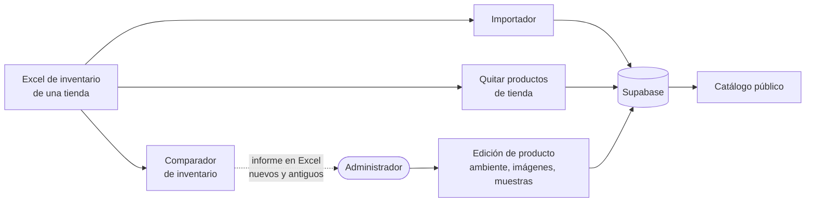
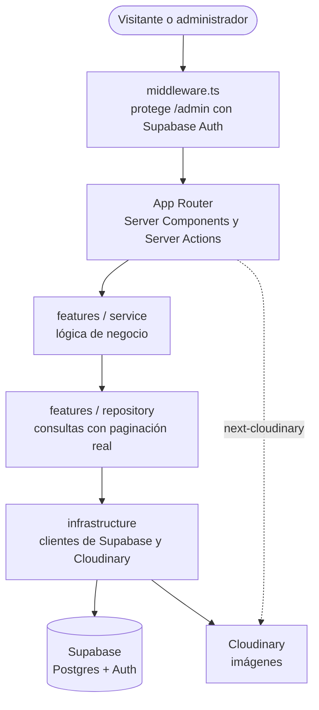
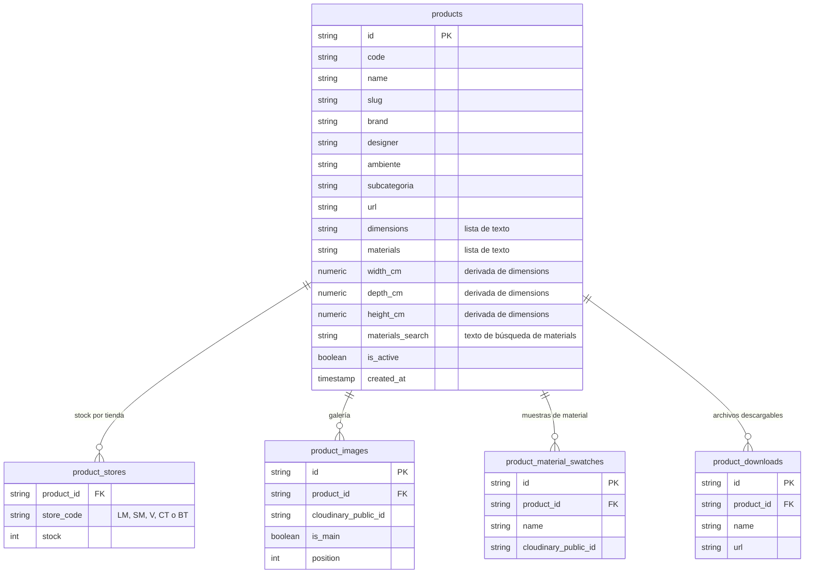

<div align="center">


# Modern Home Catalog

**El catálogo de mobiliario de Modern Home, con todas sus tiendas en un mismo sitio.**
Catálogo público navegable por ambientes y un panel de administración para gestionar productos, imágenes y el stock de cada tienda.

[](https://nextjs.org)
[](https://react.dev)
[](https://www.typescriptlang.org)
[](https://supabase.com)
[](https://cloudinary.com)
[](https://vercel.com)

</div>

> Sitio en producción: **[modernhomecatalogo.vercel.app](https://modernhomecatalogo.vercel.app)**

---

## Tabla de contenidos

- [Qué es](#qué-es)
- [Funcionalidades](#funcionalidades)
- [Flujo de trabajo del inventario](#flujo-de-trabajo-del-inventario)
- [Arquitectura](#arquitectura)
- [Rutas](#rutas)
- [Modelo de datos](#modelo-de-datos)
- [Seguridad](#seguridad)
- [Puesta en marcha](#puesta-en-marcha)
- [Variables de entorno](#variables-de-entorno)
- [Scripts](#scripts)
- [Despliegue](#despliegue)
- [Estructura del repositorio](#estructura-del-repositorio)
- [Decisiones de diseño](#decisiones-de-diseño)

## Qué es

Modern Home Catalog es una aplicación web con dos caras:

| Parte | Quién la usa | Qué hace |
|---|---|---|
| **Catálogo público** | Clientes | Permite explorar el mobiliario por ambiente y subcategoría y ver la ficha completa de cada producto. |
| **Panel `/admin`** | Equipo de Modern Home | Da de alta y edita productos, sube imágenes, y mantiene el stock de cada tienda a partir de sus Excel de inventario. |

Un mismo producto puede estar disponible en varias tiendas, cada una con su propio stock:

| Código | Tienda |
|---|---|
| `LM` | Las Mercedes |
| `SM` | Santa Mónica |
| `V` | Valencia |
| `CT` | La Castellana |
| `BT` | Barquisimeto |

## Funcionalidades

### Catálogo público

- **Navegación por ambientes y subcategorías** (Sala, Comedor, Dormitorio, Exterior, Complementos y los que se añadan). En móvil los ambientes se muestran como desplegable.
- **Cuadrícula paginada** de 21 productos por página, con los más recientes primero.
- **Ficha de producto:** galería de imágenes con miniaturas, dimensiones, materiales, muestras de material y botón de descarga de un archivo asociado (por ejemplo, una ficha técnica).
- Solo se muestran los productos **publicados**. Los ocultos y los que aún no están clasificados no aparecen.
- La página de inicio redirige a `/catalogo`.

### Panel de administración

- **Acceso con correo y contraseña** (Supabase Auth).
- **Gestión de productos:** listado paginado con búsqueda y filtros por estado (activos, ocultos), imágenes (con o sin), tienda, ambiente, subcategoría y stock (con o sin).
- **Edición de producto:** código, nombre, marca, diseñador, ambiente, subcategoría, dimensiones y materiales (uno por línea), tiendas con su stock, imágenes, muestras de material y archivo descargable. El *slug* se genera solo si se deja vacío.
- **Publicar u ocultar** un producto sin borrarlo, o eliminarlo.
- **Importador de inventario:** sube el Excel de una tienda y crea los productos nuevos, los asigna a la tienda y actualiza su stock.
- **Comparador de inventario:** compara el Excel de una tienda con lo que hay en base de datos y devuelve dos Excel descargables: productos nuevos (no asignados a la tienda) y productos antiguos (asignados pero ausentes del Excel).
- **Quitar productos de una tienda:** con el Excel de los productos a retirar, elimina su asignación a la tienda y desactiva los que se quedan sin ninguna.
- **Exportar el catálogo a Excel**, con o sin los productos ocultos.

Las tres herramientas aceptan `.xlsx`, `.xls` y `.csv` y identifican cada producto por la columna `Código`. El importador usa además `Descripción`, `Marca` y `Stock`.

## Flujo de trabajo del inventario



Los productos que crea el importador llevan ambiente y subcategoría `general`, y **no aparecen en el catálogo público hasta que el administrador los clasifica** desde la edición del producto.

## Arquitectura



El código sigue una arquitectura por dominios ([`features/README.md`](features/README.md)): `UI → Service → Repository → Infrastructure → Base de datos`.

| Capa | Responsabilidad |
|---|---|
| **Service** | Lógica de negocio y orquestación. |
| **Repository** | Acceso directo a la base de datos. |
| **Infrastructure** | Clientes de Supabase (servidor, navegador y middleware) y de Cloudinary. |

## Rutas

| Ruta | Descripción | Acceso |
|---|---|---|
| `/` | Redirige a `/catalogo` | Pública |
| `/catalogo` | Todos los productos (paginado) | Pública |
| `/catalogo/[ambiente]` | Productos de un ambiente | Pública |
| `/catalogo/[ambiente]/[subcategoria]` | Productos de una subcategoría | Pública |
| `/catalogo/[ambiente]/[subcategoria]/[producto]` | Ficha del producto | Pública |
| `/admin/login` | Inicio de sesión | Pública |
| `/admin` | Panel con acceso a las herramientas | Con sesión |
| `/admin/products` | Gestión de productos (búsqueda y filtros) | Con sesión |
| `/admin/products/new` | Nuevo producto | Con sesión |
| `/admin/products/[id]` | Editar producto | Con sesión |
| `/admin/import` | Importador de inventario | Con sesión |
| `/admin/inventory` | Comparador de inventario | Con sesión |
| `/admin/deactivate` | Quitar productos de una tienda | Con sesión |

## Modelo de datos

La aplicación usa cinco tablas de Supabase (PostgreSQL). Las imágenes no se guardan en la base de datos: solo su identificador de Cloudinary (`cloudinary_public_id`).

| Tabla | Contenido |
|---|---|
| `products` | Ficha del producto: código, nombre, *slug*, marca, diseñador, ambiente, subcategoría, dimensiones y materiales (listas de texto), medidas numéricas en cm derivadas de las dimensiones (`width_cm`, `depth_cm`, `height_cm`; se calculan al guardar el producto), un texto de búsqueda de los materiales (`materials_search`, mantenido por un *trigger*), enlace externo y estado de publicación (`is_active`). |
| `product_stores` | Asignación de un producto a una tienda, con su stock. Combinación única `(product_id, store_code)`. |
| `product_images` | Galería del producto: imagen de Cloudinary, si es la principal y su posición. |
| `product_material_swatches` | Muestras de material: nombre e imagen de Cloudinary. |
| `product_downloads` | Archivo descargable del producto: nombre y URL. |



Los ambientes y las subcategorías no tienen tabla propia: se obtienen de los valores de los productos publicados.

## Seguridad

- **Las rutas `/admin` exigen sesión.** El middleware redirige a `/admin/login` a quien no la tiene, y envía al panel a quien ya la tiene si abre el login.
- **La sesión se valida contra Supabase** con `getUser()` en cada petición, y no solo leyendo la cookie, para que no pueda falsificarse.
- **Cabeceras de seguridad** en todas las respuestas: `X-Frame-Options: DENY`, `X-Content-Type-Options: nosniff`, `Referrer-Policy` y `Permissions-Policy` (sin cámara, micrófono ni geolocalización).
- **Content Security Policy** en producción, ajustada para Supabase y el widget de subida de Cloudinary.
- Las imágenes remotas solo se aceptan desde `res.cloudinary.com`.

## Puesta en marcha

### Requisitos

- **Node.js 20.9 o superior** (lo exige Next.js 16) y npm.
- Un proyecto de [Supabase](https://supabase.com) con las tablas descritas en [Modelo de datos](#modelo-de-datos): ejecuta [`database/schema.sql`](database/schema.sql) en el **SQL Editor** (y, si quieres un producto de ejemplo, [`database/seed.sql`](database/seed.sql)). Crea además un usuario en **Authentication > Users** para entrar al panel.
- Una cuenta de [Cloudinary](https://cloudinary.com) con un *upload preset* para las subidas del panel (sin firma: la aplicación no configura un endpoint de firmado).

### Instalación

```bash
npm install
cp .env.example .env.local   # y completa las variables (ver la sección siguiente)
npm run dev
```

La aplicación queda en <http://localhost:3000>. El panel está en <http://localhost:3000/admin>.

## Variables de entorno

Se definen en `.env.local` (no se sube al repositorio). Hay una plantilla en [`.env.example`](.env.example).

| Variable | Obligatoria | Descripción |
|---|:---:|---|
| `NEXT_PUBLIC_SUPABASE_URL` | ✅ | URL del proyecto de Supabase. |
| `NEXT_PUBLIC_SUPABASE_ANON_KEY` | ✅ | Clave pública `anon` de Supabase. |
| `NEXT_PUBLIC_CLOUDINARY_CLOUD_NAME` | ✅ | Nombre de la cuenta (*cloud name*) de Cloudinary. |
| `NEXT_PUBLIC_CLOUDINARY_UPLOAD_PRESET` | Para subir imágenes | *Upload preset* que usa el widget de subida del panel. Si no se define, se usa `ml_default`. |
| `ANTHROPIC_API_KEY` | Para la búsqueda con IA | Clave de la API de Anthropic. Solo servidor: no lleva el prefijo `NEXT_PUBLIC_`. |
| `ANTHROPIC_MODEL` | No | Modelo de Claude para la búsqueda con IA. Por defecto, `claude-haiku-4-5-20251001`. |

## Scripts

| Comando | Acción |
|---|---|
| `npm run dev` | Servidor de desarrollo. |
| `npm run build` | Build de producción. |
| `npm run start` | Sirve el build de producción. |
| `npm run lint` | ESLint. |
| `npm test` | Pruebas unitarias con Vitest (una sola ejecución). |
| `npm run test:watch` | Vitest en modo vigilancia: repite las pruebas al guardar. |

## Despliegue

El proyecto se despliega en **Vercel** ([modernhomecatalogo.vercel.app](https://modernhomecatalogo.vercel.app)). Vercel detecta Next.js automáticamente: conecta el repositorio y define las variables de entorno de la sección anterior (Production y Preview).

## Estructura del repositorio

```text
app/
  (catalog)/            Catálogo público: layout con navbar y filtros, y rutas /catalogo/**
  admin/                Panel: login, gestión de productos, importador, comparador y baja por tienda
    actions.ts          Server Actions: productos, imágenes, muestras, descargables e inventario
components/
  admin/                Tabla, filtros, formulario y gestores de imágenes, muestras y descargas
  catalog/              Cuadrícula, ficha de producto y barra de filtros
  layout/               Navbar
  ui/                   Paginación y wrapper de imágenes de Cloudinary
features/
  products/             Repository, service y tipos de producto (tiendas, stock, imágenes), parser de dimensiones y lectura de los filtros de /admin/products desde la URL
  ambientes/            Ambientes del catálogo
  subcategorias/        Subcategorías del catálogo
  inventory/            Importación, comparación y exportación de inventario en Excel
infrastructure/
  supabase/             Clientes de Supabase: servidor, navegador y middleware
  cloudinary/           Cliente de Cloudinary
database/
  schema.sql            Esquema de las cinco tablas (se puede ejecutar sobre una base de datos existente)
  migrations/           Cambios de esquema para bases ya creadas (001: medidas en cm · 002: texto de búsqueda de materiales)
  seed.sql              Producto de ejemplo con tienda, imágenes, muestras y descargable
public/icons/           Logotipo e iconos
scripts/                Utilidades de uso único (importación, tiendas, backfill de medidas)
middleware.ts           Protección de /admin y refresco de la sesión
vitest.config.mts       Configuración de Vitest (alias `@`, pruebas junto al código en `*.test.ts`)
next.config.mjs         Cabeceras de seguridad, CSP e imágenes remotas
```

## Decisiones de diseño

- **Paginación real en la base de datos.** Las consultas usan `.range()` y un conteo aparte, así que solo viajan las filas de la página actual. Está pensado para un catálogo de miles de productos.
- **Arquitectura por dominios.** Cada dominio (`products`, `inventory`...) agrupa su lógica, y el flujo `Service → Repository → Infrastructure` evita mezclar reglas de negocio con acceso a datos.
- **Stock por tienda.** Un producto se asigna a varias tiendas con su propio stock (`product_stores`), en lugar de duplicar el producto por tienda.
- **El inventario se mantiene con Excel.** El panel importa y compara los Excel de inventario de cada tienda en vez de obligar a introducir los datos a mano. Los productos que se quedan sin ninguna tienda se desactivan, no se borran.
- **Ocultar en lugar de borrar.** `is_active` permite retirar un producto del catálogo sin perder su ficha ni sus imágenes.
- **Solo el identificador de la imagen en la base de datos.** Cloudinary aloja las imágenes y la aplicación guarda únicamente su `cloudinary_public_id`. Next.js cachea las imágenes procesadas durante 7 días.
- **Server Components y Server Actions.** Las páginas se renderizan en el servidor y las mutaciones del panel son Server Actions, sin una API REST propia.
- **`getUser()` en el middleware.** Valida el token con Supabase en cada petición; leer solo la sesión de la cookie permitiría suplantarla.
- **CSP solo en producción.** En desarrollo Turbopack necesita conexiones que la política bloquearía (HMR y peticiones RSC).
- **CSS Modules sin frameworks.** Estilos aislados por componente y sin dependencias de UI externas.
