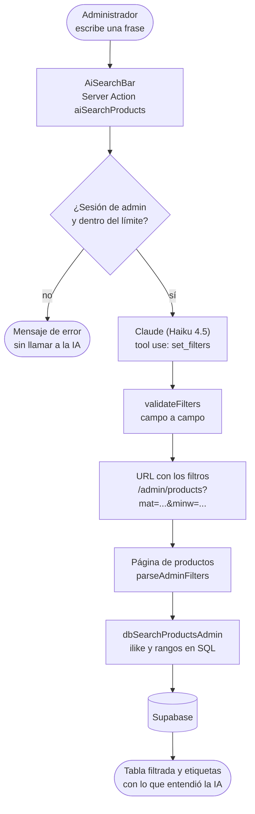
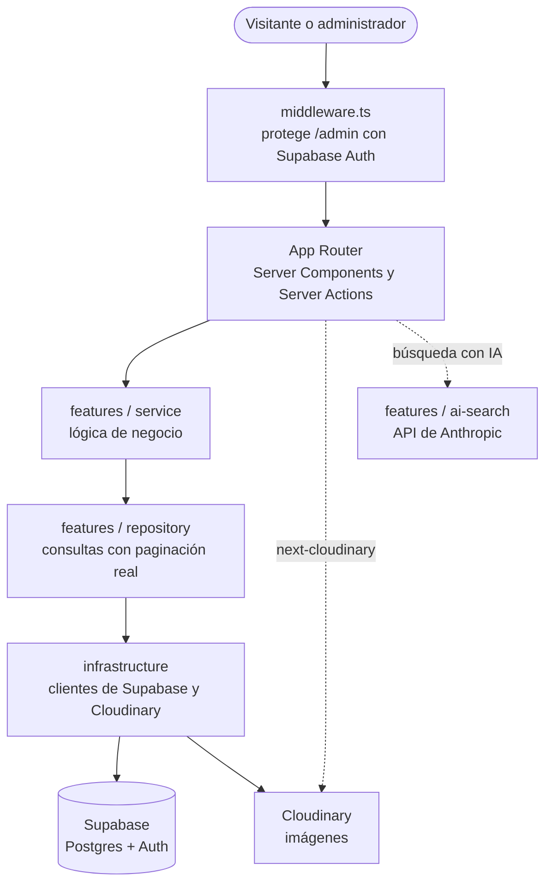
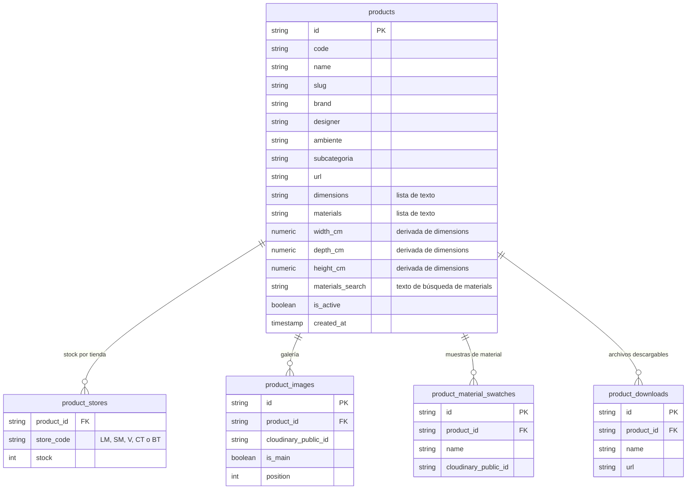

<div align="center">


# Modern Home Catalog

**El catálogo de mobiliario de Modern Home, con todas sus tiendas en un mismo sitio.**
Catálogo público navegable por ambientes y un panel de administración para gestionar productos, imágenes y el stock de cada tienda, con búsqueda en lenguaje natural.

[](https://nextjs.org)
[](https://react.dev)
[](https://www.typescriptlang.org)
[](https://supabase.com)
[](https://cloudinary.com)
[](https://platform.claude.com/docs)
[](https://vitest.dev)
[](https://vercel.com)

</div>

> Sitio en producción: **[modernhomecatalogo.vercel.app](https://modernhomecatalogo.vercel.app)**

---

## Tabla de contenidos

- [Qué es](#qué-es)
- [Funcionalidades](#funcionalidades)
- [Búsqueda con IA](#búsqueda-con-ia)
- [Flujo de trabajo del inventario](#flujo-de-trabajo-del-inventario)
- [Stack tecnológico](#stack-tecnológico)
- [Arquitectura](#arquitectura)
- [Rutas](#rutas)
- [Modelo de datos](#modelo-de-datos)
- [Seguridad](#seguridad)
- [Puesta en marcha](#puesta-en-marcha)
- [Variables de entorno](#variables-de-entorno)
- [Scripts](#scripts)
- [Tests](#tests)
- [Despliegue](#despliegue)
- [Estructura del repositorio](#estructura-del-repositorio)
- [Decisiones de diseño](#decisiones-de-diseño)

## Qué es

Modern Home Catalog es una aplicación web con dos caras:

| Parte | Quién la usa | Qué hace |
|---|---|---|
| **Catálogo público** | Clientes | Permite explorar el mobiliario por ambiente y subcategoría y ver la ficha completa de cada producto. |
| **Panel `/admin`** | Equipo de Modern Home | Da de alta y edita productos, sube imágenes, mantiene el stock de cada tienda a partir de sus Excel de inventario y encuentra productos escribiendo lo que busca con sus propias palabras. |

Un mismo producto puede estar disponible en varias tiendas, cada una con su propio stock:

| Código | Tienda |
|---|---|
| `LM` | Las Mercedes |
| `SM` | Santa Mónica |
| `V` | Valencia |
| `CT` | La Castellana |
| `BT` | Barquisimeto |

## Funcionalidades

### Catálogo público

- **Navegación por ambientes y subcategorías** (Sala, Comedor, Dormitorio, Exterior, Complementos y los que se añadan). En móvil los ambientes se muestran como desplegable.
- **Cuadrícula paginada** de 21 productos por página, con los más recientes primero.
- **Ficha de producto:** galería de imágenes con miniaturas, dimensiones, materiales, muestras de material y botón de descarga de un archivo asociado (por ejemplo, una ficha técnica).
- Solo se muestran los productos **publicados**. Los ocultos y los que aún no están clasificados no aparecen.
- La página de inicio redirige a `/catalogo`.

### Panel de administración

- **Acceso con correo y contraseña** (Supabase Auth).
- **Gestión de productos:** listado paginado con búsqueda y filtros por estado (activos, ocultos), imágenes (con o sin), tienda, ambiente, subcategoría y stock (con o sin).
- **Búsqueda con IA:** un campo en lenguaje natural sobre el listado (*"mesas de comedor de madera de más de 2 m"*). Se traduce a filtros que se aplican en la URL y se muestran como etiquetas que se quitan una a una. Detalle en [Búsqueda con IA](#búsqueda-con-ia).
- **Edición de producto:** código, nombre, marca, diseñador, ambiente, subcategoría, dimensiones y materiales (uno por línea), tiendas con su stock, imágenes, muestras de material y archivo descargable. El *slug* se genera solo si se deja vacío. Mientras se escriben las dimensiones, el formulario muestra qué medidas entenderá el buscador.
- **Publicar u ocultar** un producto sin borrarlo, o eliminarlo.
- **Importador de inventario:** sube el Excel de una tienda y crea los productos nuevos, los asigna a la tienda y actualiza su stock.
- **Comparador de inventario:** compara el Excel de una tienda con lo que hay en base de datos y devuelve dos Excel descargables: productos nuevos (no asignados a la tienda) y productos antiguos (asignados pero ausentes del Excel).
- **Quitar productos de una tienda:** con el Excel de los productos a retirar, elimina su asignación a la tienda y desactiva los que se quedan sin ninguna.
- **Exportar el catálogo a Excel**, con o sin los productos ocultos.

Las tres herramientas de inventario aceptan `.xlsx`, `.xls` y `.csv` y identifican cada producto por la columna `Código`. El importador usa además `Descripción`, `Marca` y `Stock`.

## Búsqueda con IA

El administrador escribe una frase y Claude la convierte en filtros; la base de datos hace la búsqueda. La IA nunca ve los productos: recibe solo la frase y las listas de valores válidos (ambientes, subcategorías y tiendas).



1. **Frase → filtros.** Claude devuelve los filtros llamando a una herramienta (`set_filters`) cuyo esquema se genera con Zod a partir del catálogo.
2. **Validación campo a campo.** Un campo inválido se descarta y no arrastra a los demás. Se eliminan los filtros sin efecto (mínimo 0, máximo 1000), las medidas imposibles para un mueble (más de 600 cm) y se intercambian los mínimos mayores que los máximos.
3. **La URL es el estado.** La IA solo escribe una dirección; la página la lee igual que si los filtros se hubieran elegido a mano, así que se puede recargar, compartir, paginar y afinar con los filtros manuales. La búsqueda con IA **reemplaza** los filtros actuales.
4. **Etiquetas.** Los filtros activos se muestran como etiquetas con una × (*"Largo ≥ 200 cm"*, *"Material: madera, wood, nogal +4"*). Si la frase no contiene ningún filtro, avisa y conserva los que había.

Ejemplos de frases reales y los filtros que producen:

| Frase | Filtros |
|---|---|
| *mesas de comedor de madera de más de 2 m* | ambiente `comedor`, subcategoría `mesas`, materiales (`madera`, `wood`, `nogal`...), largo ≥ 200 cm |
| *sofás en Valencia con stock* | subcategoría `sofas`, tienda `V`, con stock |
| *productos ocultos de la tienda de Barquisimeto* | tienda `BT`, estado oculto |
| *mesa de mármol de 120 de ancho y 200 de largo* | subcategoría `mesas`, materiales `mármol`/`marmol`, largo 190–210 cm, profundidad 114–126 cm |
| *alfombras sin imágenes* | subcategoría `alfombras`, sin imagen |

Al interpretar las medidas, la IA aplica un margen: del 5 % si no hay comparador (*"de 200 de largo"*) y del 10 % con *"unos 160"*.

### Datos que hacen posible la búsqueda

| Dato | Cómo se obtiene |
|---|---|
| `width_cm`, `depth_cm`, `height_cm` | Se calculan al guardar el producto a partir del texto de `dimensions` ([`dimensions.parser.ts`](features/products/dimensions.parser.ts)). El texto original no cambia y es el que se muestra en la ficha. |
| `materials_search` | Todos los materiales en un solo texto, en minúsculas y sin tildes, mantenido por un *trigger* de la base de datos. Permite buscar "mármol" o "marmol" con un `ilike`. |

En las fichas, "Ancho" significa cosas distintas según qué otras medidas lleve (con "Largo" es la profundidad; sin él, es el lado frontal), así que las columnas tienen un significado fijo:

| Columna | Se rellena con |
|---|---|
| `width_cm` | `Largo`; o `Ancho` si la ficha no tiene `Largo` |
| `depth_cm` | `Profundidad` (también `Profundo` o `Fondo`); o `Ancho` si la ficha tiene `Largo` |
| `height_cm` | `Alto` (o `Altura`) |

El parser entiende la coma decimal, metros, pies, rangos y alternativas con `/` (guarda el valor mayor) y diámetros. Ignora las medidas que no son del producto, como el grosor de una alfombra o la altura del asiento.

### Coste y límites

- Cada búsqueda cuesta del orden de **0,003 USD** con Haiku 4.5 (unos 2.600 tokens de entrada).
- Solo con sesión de admin, máximo **10 búsquedas por minuto y usuario** (contador en memoria) y **300 caracteres** por frase.
- Se recomienda fijar un límite de gasto mensual en la consola de Anthropic.

### Probarla contra la API real

⚠️ Estos comandos llaman a la API de Anthropic y **cuestan dinero** (unos 0,003 USD por frase).

```bash
npx tsx scripts/try_ai_search.ts                               # 10 frases de ejemplo
npx tsx scripts/try_ai_search.ts "sofás de exterior con stock"  # una frase propia
npx tsx scripts/try_ai_search.ts --adversarial                 # 21 casos malos: inyecciones, absurdos, otros idiomas...
```

## Flujo de trabajo del inventario


Los productos que crea el importador llevan ambiente y subcategoría `general`, y **no aparecen en el catálogo público hasta que el administrador los clasifica** desde la edición del producto.

## Stack tecnológico

| Capa | Tecnología |
|---|---|
| Framework | [Next.js](https://nextjs.org) 16 (App Router, Server Components y Server Actions) |
| UI | [React](https://react.dev) 19 y CSS Modules, sin frameworks de UI |
| Lenguaje | [TypeScript](https://www.typescriptlang.org) 5 |
| Base de datos y autenticación | [Supabase](https://supabase.com) (PostgreSQL y Auth) con `@supabase/supabase-js` y `@supabase/ssr` |
| Imágenes | [Cloudinary](https://cloudinary.com) con `next-cloudinary` |
| Búsqueda con IA | [API de Anthropic](https://platform.claude.com/docs) (`@anthropic-ai/sdk`, Claude Haiku 4.5) y [Zod](https://zod.dev) 4 |
| Excel | [ExcelJS](https://github.com/exceljs/exceljs) (exportación) y [SheetJS](https://sheetjs.com) (lectura de inventarios) |
| Tests | [Vitest](https://vitest.dev) 5 |
| Alojamiento | [Vercel](https://vercel.com) |

## Arquitectura



El código sigue una arquitectura por dominios ([`features/README.md`](features/README.md)): `UI → Service → Repository → Infrastructure → Base de datos`.

| Capa | Responsabilidad |
|---|---|
| **Service** | Lógica de negocio y orquestación. |
| **Repository** | Acceso directo a la base de datos. |
| **Infrastructure** | Clientes de Supabase (servidor, navegador y middleware) y de Cloudinary. |

## Rutas

| Ruta | Descripción | Acceso |
|---|---|---|
| `/` | Redirige a `/catalogo` | Pública |
| `/catalogo` | Todos los productos (paginado) | Pública |
| `/catalogo/[ambiente]` | Productos de un ambiente | Pública |
| `/catalogo/[ambiente]/[subcategoria]` | Productos de una subcategoría | Pública |
| `/catalogo/[ambiente]/[subcategoria]/[producto]` | Ficha del producto | Pública |
| `/admin/login` | Inicio de sesión | Pública |
| `/admin` | Panel con acceso a las herramientas | Con sesión |
| `/admin/products` | Gestión de productos (búsqueda, filtros y búsqueda con IA) | Con sesión |
| `/admin/products/new` | Nuevo producto | Con sesión |
| `/admin/products/[id]` | Editar producto | Con sesión |
| `/admin/import` | Importador de inventario | Con sesión |
| `/admin/inventory` | Comparador de inventario | Con sesión |
| `/admin/deactivate` | Quitar productos de una tienda | Con sesión |

Los filtros de `/admin/products` se leen de la URL:

| Parámetro | Filtro |
|---|---|
| `q` | Texto en código o nombre |
| `status`, `images`, `stock` | Estado (`active`, `hidden`), imágenes (`with`, `without`), stock (`instock`, `nostock`) |
| `store`, `ambiente`, `subcategoria` | Tienda, ambiente y subcategoría |
| `mat` | Materiales separados por coma (basta con que coincida uno) |
| `minw`, `maxw` | Largo o ancho frontal, en cm |
| `mind`, `maxd` | Profundidad, en cm |
| `minh`, `maxh` | Alto, en cm |
| `page` | Página |

## Modelo de datos

La aplicación usa cinco tablas de Supabase (PostgreSQL). Las imágenes no se guardan en la base de datos: solo su identificador de Cloudinary (`cloudinary_public_id`).

| Tabla | Contenido |
|---|---|
| `products` | Ficha del producto: código, nombre, *slug*, marca, diseñador, ambiente, subcategoría, dimensiones y materiales (listas de texto), medidas numéricas en cm derivadas de las dimensiones (`width_cm`, `depth_cm`, `height_cm`), un texto de búsqueda de los materiales (`materials_search`), enlace externo y estado de publicación (`is_active`). |
| `product_stores` | Asignación de un producto a una tienda, con su stock. Combinación única `(product_id, store_code)`. |
| `product_images` | Galería del producto: imagen de Cloudinary, si es la principal y su posición. |
| `product_material_swatches` | Muestras de material: nombre e imagen de Cloudinary. |
| `product_downloads` | Archivo descargable del producto: nombre y URL. |



Los ambientes y las subcategorías no tienen tabla propia: se obtienen de los valores de los productos publicados.

## Seguridad

- **Las rutas `/admin` exigen sesión.** El middleware redirige a `/admin/login` a quien no la tiene, y envía al panel a quien ya la tiene si abre el login.
- **La sesión se valida contra Supabase** con `getUser()` en cada petición, y no solo leyendo la cookie, para que no pueda falsificarse. Cada Server Action del panel vuelve a comprobarla (`requireAuth`).
- **Políticas de acceso (RLS) en Supabase:** la tabla `products` tiene RLS con dos políticas: lectura pública para el rol `anon` y lectura y escritura completas para `authenticated` (la sesión de administrador).
- **Cabeceras de seguridad** en todas las respuestas: `X-Frame-Options: DENY`, `X-Content-Type-Options: nosniff`, `Referrer-Policy` y `Permissions-Policy` (sin cámara, micrófono ni geolocalización).
- **Content Security Policy** en producción, ajustada para Supabase y el widget de subida de Cloudinary.
- Las imágenes remotas solo se aceptan desde `res.cloudinary.com`.
- **Búsqueda con IA:**
  - La clave `ANTHROPIC_API_KEY` solo existe en el servidor (no lleva el prefijo `NEXT_PUBLIC_`).
  - Nunca se confía en la respuesta del modelo: se valida campo a campo contra el catálogo real.
  - Los textos que van dentro de una expresión de filtro (nombre, código, materiales) se limpian de comillas, comas, paréntesis y `%` en el repositorio y en la validación, para que una frase o una URL no puedan añadir condiciones propias.
  - Si la IA responde con texto en lugar de filtros, ese texto no se muestra al usuario.
  - Hay pruebas automáticas y un modo adversarial (`--adversarial`) con intentos de manipulación del prompt y de inyección.

## Puesta en marcha

### Requisitos

- **Node.js 20.9 o superior** (lo exige Next.js 16) y npm.
- Un proyecto de [Supabase](https://supabase.com) con las tablas descritas en [Modelo de datos](#modelo-de-datos). Crea además un usuario en **Authentication > Users** para entrar al panel.
- Una cuenta de [Cloudinary](https://cloudinary.com) con un *upload preset* para las subidas del panel (sin firma: la aplicación no configura un endpoint de firmado).
- Para la búsqueda con IA, una clave de la [API de Anthropic](https://console.anthropic.com).

### Instalación

```bash
npm install
cp .env.example .env.local   # y completa las variables (ver la sección siguiente)
npm run dev
```

La aplicación queda en <http://localhost:3000>. El panel está en <http://localhost:3000/admin>.

### Base de datos

En el **SQL Editor** de Supabase:

- **Base nueva:** ejecuta [`database/schema.sql`](database/schema.sql) (esquema completo, con las columnas de medidas y el *trigger* de materiales) y, si quieres un producto de ejemplo, [`database/seed.sql`](database/seed.sql).
- **Base que ya tenía las tablas:** ejecuta en orden las migraciones de [`database/migrations/`](database/migrations/) (cada una se puede repetir sin riesgo) y rellena las medidas de los productos existentes:

  | Migración | Qué añade |
  |---|---|
  | [`001_add_dimension_columns.sql`](database/migrations/001_add_dimension_columns.sql) | Columnas `width_cm`, `depth_cm` y `height_cm` |
  | [`002_add_materials_search.sql`](database/migrations/002_add_materials_search.sql) | Columna `materials_search` y el *trigger* que la mantiene |
  | [`003_materials_search_unaccent.sql`](database/migrations/003_materials_search_unaccent.sql) | Búsqueda de materiales sin tildes |

  ```bash
  # Genera scripts/backfill_dimensions.generated.sql con las medidas de los productos que ya existen
  npx tsx scripts/backfill_dimensions.ts          # informe: no escribe nada
  npx tsx scripts/backfill_dimensions.ts --sql    # genera el archivo SQL
  # Pega el archivo generado en el SQL Editor y ejecútalo
  ```

  El script no escribe en la base de datos (la clave pública solo puede leer): genera un SQL que se ejecuta en el editor. Los productos que se guarden desde el panel calculan sus medidas solos.

## Variables de entorno

Se definen en `.env.local` (no se sube al repositorio). Hay una plantilla en [`.env.example`](.env.example).

| Variable | Obligatoria | Descripción |
|---|:---:|---|
| `NEXT_PUBLIC_SUPABASE_URL` | ✅ | URL del proyecto de Supabase. |
| `NEXT_PUBLIC_SUPABASE_ANON_KEY` | ✅ | Clave pública `anon` de Supabase. |
| `NEXT_PUBLIC_CLOUDINARY_CLOUD_NAME` | ✅ | Nombre de la cuenta (*cloud name*) de Cloudinary. |
| `NEXT_PUBLIC_CLOUDINARY_UPLOAD_PRESET` | Para subir imágenes | *Upload preset* que usa el widget de subida del panel. Si no se define, se usa `ml_default`. |
| `ANTHROPIC_API_KEY` | Para la búsqueda con IA | Clave de la API de Anthropic. Solo servidor: no lleva el prefijo `NEXT_PUBLIC_`. |
| `ANTHROPIC_MODEL` | No | Modelo de Claude para la búsqueda con IA. Por defecto, `claude-haiku-4-5-20251001`. |

## Scripts

| Comando | Acción |
|---|---|
| `npm run dev` | Servidor de desarrollo. |
| `npm run build` | Build de producción. |
| `npm run start` | Sirve el build de producción. |
| `npm test` | Pruebas unitarias con Vitest (una sola ejecución). |
| `npm run test:watch` | Vitest en modo vigilancia: repite las pruebas al guardar. |
| `npx tsx scripts/backfill_dimensions.ts [--sql]` | Calcula las medidas en cm de los productos existentes y, con `--sql`, genera el SQL para aplicarlas. |
| `npx tsx scripts/try_ai_search.ts [frase] [--adversarial]` | ⚠️ Prueba la búsqueda con IA contra la API real (cuesta dinero). |

## Tests

`npm test` ejecuta **123 pruebas** en unos segundos, sin red y sin coste: la lógica está escrita como funciones puras y la API de Anthropic se sustituye por un cliente falso. Las llamadas reales a la IA se prueban a mano con `scripts/try_ai_search.ts`.

| Área | Pruebas | Qué comprueban |
|---|:---:|---|
| Parser de dimensiones | 20 | Etiquetas ("Largo", "Ancho", "Profundo"...), coma decimal, metros, pies, rangos, grosores y medidas parciales |
| Filtros de la URL | 13 | Leer y escribir los parámetros de `/admin/products`, con ida y vuelta |
| Etiquetas de filtros | 9 | Texto de cada filtro activo y qué parámetros borra |
| Términos de búsqueda | 9 | Quitar tildes y caracteres de sintaxis del filtro (inyección) |
| Esquema de la IA | 13 | Valores permitidos, límites de medidas y JSON Schema de la herramienta |
| Servicio de IA | 24 | Entrada inválida, respuestas anómalas, errores de la API y contenido del prompt |
| Validación de la IA | 23 | Rescatar campos buenos, medidas sin sentido y campos peligrosos como `__proto__` |
| Búsqueda completa | 6 | Frase → URL → filtros de la página |
| Límite de peticiones | 6 | Ventana deslizante con reloj simulado |

## Despliegue

El proyecto se despliega en **Vercel** ([modernhomecatalogo.vercel.app](https://modernhomecatalogo.vercel.app)). Vercel detecta Next.js automáticamente: conecta el repositorio y define las variables de entorno de la sección anterior (Production y Preview), incluida `ANTHROPIC_API_KEY` si se usa la búsqueda con IA. Las migraciones de la base de datos se ejecutan a mano en Supabase, no en el build.

## Estructura del repositorio

```text
app/
  (catalog)/            Catálogo público: layout con navbar y filtros, y rutas /catalogo/**
  admin/                Panel: login, gestión de productos, importador, comparador y baja por tienda
    actions.ts          Server Actions: productos, imágenes, muestras, descargables, inventario y búsqueda con IA
components/
  admin/                Tabla, filtros, búsqueda con IA, formulario y gestores de imágenes, muestras y descargas
  catalog/              Cuadrícula, ficha de producto y barra de filtros
  layout/               Navbar
  ui/                   Paginación y wrapper de imágenes de Cloudinary
features/
  products/             Repository, service y tipos de producto; parser de dimensiones; filtros de /admin/products desde y hacia la URL
  ambientes/            Ambientes del catálogo
  subcategorias/        Subcategorías del catálogo
  inventory/            Importación, comparación y exportación de inventario en Excel
  ai-search/            Búsqueda con IA: esquema de filtros (Zod), prompt, servicio, validación y límite de peticiones
infrastructure/
  supabase/             Clientes de Supabase: servidor, navegador y middleware
  cloudinary/           Cliente de Cloudinary
database/
  schema.sql            Esquema de las cinco tablas (se puede ejecutar sobre una base de datos existente)
  migrations/           Cambios de esquema para bases ya creadas (001, 002 y 003)
  seed.sql              Producto de ejemplo con tienda, imágenes, muestras y descargable
public/icons/           Logotipo e iconos
scripts/                Utilidades de línea de comandos: medidas de los productos existentes y prueba de la búsqueda con IA
middleware.ts           Protección de /admin y refresco de la sesión
vitest.config.mts       Configuración de Vitest (alias `@`, pruebas junto al código en `*.test.ts`)
next.config.mjs         Cabeceras de seguridad, CSP e imágenes remotas
```

## Decisiones de diseño

### Catálogo y datos

- **Paginación real en la base de datos.** Las consultas usan `.range()` y un conteo aparte, así que solo viajan las filas de la página actual. Está pensado para un catálogo de miles de productos.
- **Arquitectura por dominios.** Cada dominio (`products`, `inventory`...) agrupa su lógica, y el flujo `Service → Repository → Infrastructure` evita mezclar reglas de negocio con acceso a datos.
- **Stock por tienda.** Un producto se asigna a varias tiendas con su propio stock (`product_stores`), en lugar de duplicar el producto por tienda.
- **El inventario se mantiene con Excel.** El panel importa y compara los Excel de inventario de cada tienda en vez de obligar a introducir los datos a mano. Los productos que se quedan sin ninguna tienda se desactivan, no se borran.
- **Ocultar en lugar de borrar.** `is_active` permite retirar un producto del catálogo sin perder su ficha ni sus imágenes.
- **Solo el identificador de la imagen en la base de datos.** Cloudinary aloja las imágenes y la aplicación guarda únicamente su `cloudinary_public_id`. Next.js cachea las imágenes procesadas durante 7 días.
- **Server Components y Server Actions.** Las páginas se renderizan en el servidor y las mutaciones del panel son Server Actions, sin una API REST propia.
- **`getUser()` en el middleware.** Valida el token con Supabase en cada petición; leer solo la sesión de la cookie permitiría suplantarla.
- **CSP solo en producción.** En desarrollo Turbopack necesita conexiones que la política bloquearía (HMR y peticiones RSC).
- **CSS Modules sin frameworks.** Estilos aislados por componente y sin dependencias de UI externas.

### Búsqueda con IA

- **La IA traduce, la base de datos filtra.** Claude solo convierte una frase en filtros; no recibe datos de productos. El coste por búsqueda es constante y no crece con el catálogo.
- **Tool use en lugar de salidas estructuradas.** Las salidas estructuradas obligan a escribir los campos en el orden del esquema y no permiten volver atrás: con *"ocultos de Barquisimeto"*, el modelo escribía el estado antes que la tienda y rellenaba otros campos con valores absurdos. Con tool use, las mismas frases difíciles salieron bien (8 de 8).
- **Nunca se confía en el modelo.** La validación es campo a campo y devuelve lo que se pudo rescatar; un único valor inventado no tira toda la búsqueda.
- **Los filtros viajan por la URL.** La IA solo escribe una dirección. Eso reutiliza toda la página existente y permite recargar, compartir, paginar y combinar con los filtros manuales.
- **Medidas numéricas derivadas del texto.** `dimensions` sigue siendo texto libre para la ficha; `width_cm`, `depth_cm` y `height_cm` son una copia solo para filtrar por rangos, con un significado fijo aunque las fichas llamen "Ancho" a cosas distintas.
- **Materiales sin tildes, mantenidos por un trigger.** `ilike` ignora mayúsculas pero no tildes, y no sabe mirar dentro de un `text[]`. Un texto auxiliar sin tildes, actualizado por la propia base de datos, funciona igual desde el panel, un script o el SQL Editor.
- **Sanitizar lo que entra en un filtro.** El texto de búsqueda y los materiales se insertan dentro de una expresión `.or(...)`. Un caso adversarial (`x",name.ilike."%`) devolvía todos los productos; ahora se limpian en el repositorio, que es la última defensa.
- **Control de gasto.** Solo admins con sesión, 10 búsquedas por minuto y usuario, 300 caracteres por frase y 1.000 tokens de salida.
